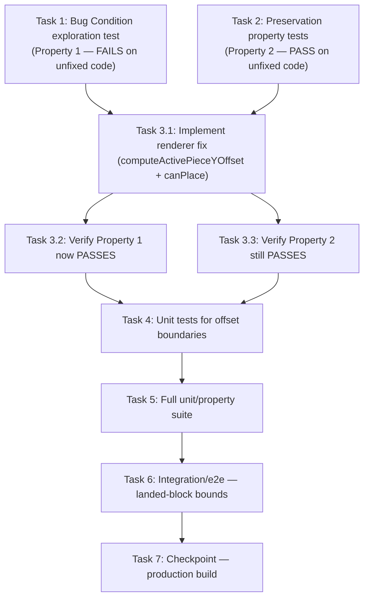

# Implementation Plan

This plan follows the exploratory bugfix workflow: explore the bug with a failing
property test FIRST, capture the behaviour to preserve, then apply the minimal renderer
fix and validate it. The fix is isolated to `PixiRenderer.drawPiece` in
`src/game/render/renderer.ts` (no core, controller, or `RenderState` changes), per the
design's Fix Implementation section.

> Testing note: tests target the offset decision in `drawPiece`. Extract the offset logic
> into a small pure helper `computeActivePieceYOffset(rs: RenderState): number` (exported
> from `src/game/render/renderer.ts`) so it is unit- and property-testable without Pixi.
> `drawPiece` then consumes this helper. Property tests use `fast-check` (already present
> in `node_modules`). Vitest files match `src/**/*.test.ts` (see `vitest.config.ts`).

- [ ] 1. Write bug condition exploration test (BEFORE implementing the fix)
  - **Property 1: Bug Condition** - Resting Piece Renders At True Row
  - **CRITICAL**: This test MUST FAIL on unfixed code - failure confirms the bug exists
  - **DO NOT attempt to fix the test or the code when it fails** - the failure is the goal here
  - **NOTE**: This test encodes the expected behavior - it will validate the fix when it passes after implementation
  - **GOAL**: Surface counterexamples proving the unconditional `yOff = fallProgress * CELL`
    pushes a resting piece below its true row / below the canvas bottom
  - Create `src/game/render/renderer.test.ts`
  - Encode the bug condition from design: `isBugCondition(rs)` = `rs.active !== null` AND
    `NOT canPlace(rs.grid, rs.active.cells, { row: rs.active.pos.row + 1, col: rs.active.pos.col })`
    AND `rs.fallProgress > 0`
  - **Scoped PBT Approach**: scope generation to resting `RenderState`s — build an empty
    `Grid` (`ROWS`×`COLS`, all `null`), place the active piece so its bottom cells occupy
    row `ROWS - 2` (so `pos.row + 1` is the floor and `canPlace` for the next row is false),
    and generate `fallProgress` in the open interval `(0, 1]`
  - Assert the offset returned by the (to-be-extracted) `computeActivePieceYOffset(rs)`
    equals `0` for every resting input, and that for all four cells
    `row * CELL + yOff + CELL <= BOARD_H` (no cell drawn below the 400px canvas)
  - Include the concrete counterexamples from design: bottom-row rest with `fallProgress = 0.5`
    (unfixed `yOff = 20`), and stack-top rest with `fallProgress = 0.5`
  - Run on UNFIXED code: `pnpm test:unit -- src/game/render/renderer.test.ts`
  - **EXPECTED OUTCOME**: Test FAILS (this is correct - it proves the bug exists)
  - Document the counterexamples found (e.g. "resting piece on row 8/floor gets yOff=20,
    drawing bottom cells at 420px, 20px below the 400px canvas")
  - Mark task complete when the test is written, run, and the failure is documented
  - _Requirements: 1.1, 1.2, 1.3, 2.1, 2.2, 2.3_

- [ ] 2. Write preservation property tests (BEFORE implementing the fix)
  - **Property 2: Preservation** - Non-Resting And Non-Active Rendering Unchanged
  - **IMPORTANT**: Follow observation-first methodology - capture the ORIGINAL behaviour on
    unfixed code, then assert the fixed code matches it
  - Define a reference `originalYOffset(rs)` = `rs.active ? rs.fallProgress * CELL : (no draw)`
    representing today's behaviour, and observe it on the unfixed code
  - **Scoped PBT Approach**: generate `RenderState`s where `isBugCondition` is FALSE across
    three sub-domains, then assert `computeActivePieceYOffset(rs)` equals the original:
    - Mid-fall (Req 3.1): active piece with at least one free row below it (`canPlace` for
      `row + 1` is true), `fallProgress` in `(0, 1]` → offset stays `fallProgress * CELL`
    - Test mode (Req 3.4): `fallProgress === 0` with any active position (resting or not)
      → offset is `0`, unchanged
    - No active piece: `rs.active === null` → `drawPiece` draws nothing (early return)
  - Generate `fallProgress` across the full `0..1` range including boundaries `0` and `1`
    to confirm no off-by-one at the lock threshold
  - Run on UNFIXED code: `pnpm test:unit -- src/game/render/renderer.test.ts`
  - **EXPECTED OUTCOME**: Tests PASS (this confirms the baseline behaviour to preserve)
  - Note: the collapse animation (Req 3.2), hard-drop grid (Req 3.3), and
    sweep/mark/flash/score visuals (Req 3.5) do not consult the active-piece offset; they
    are covered by the existing suite and the integration test in task 6
  - Mark task complete when tests are written, run, and passing on unfixed code
  - _Requirements: 3.1, 3.2, 3.3, 3.4, 3.5_

- [ ] 3. Fix for bottom-row clip (resting-piece interpolation offset)

  - [ ] 3.1 Implement the renderer fix
    - In `src/game/render/renderer.ts`, add `canPlace` to the existing import from `"../core"`
      (alongside `COLS`, `ROWS`, `Cell`, `Grid`)
    - Extract the offset decision into an exported pure helper
      `computeActivePieceYOffset(rs: RenderState): number`:
      - return `0` when `rs.active` is null (caller already early-returns; keep consistent)
      - compute `canDescend = canPlace(rs.grid, rs.active.cells, { row: rs.active.pos.row + 1, col: rs.active.pos.col })`
      - return `canDescend ? rs.fallProgress * CELL : 0`
    - In `drawPiece`, after the `if (!rs.active) return;` guard, replace
      `const yOff = rs.fallProgress * CELL;` with `const yOff = computeActivePieceYOffset(rs);`
    - Leave the four-cell `map` and `cellRect(...)` draw loop unchanged
    - Make NO changes to `piece.ts`, `controller.ts`, gravity/lock timing, or `RenderState`
    - _Bug_Condition: isBugCondition(rs) — rs.active present AND NOT canPlace(rs.grid, cells, {row: pos.row+1, col: pos.col}) AND rs.fallProgress > 0_
    - _Expected_Behavior: yOff = canDescend ? rs.fallProgress * CELL : 0 (zero offset when resting; piece renders on true grid row in bounds)_
    - _Preservation: Smooth descent (3.1), collapse (3.2), hard-drop (3.3), test-mode (3.4), sweep/mark/flash/score (3.5) unchanged_
    - _Requirements: 2.1, 2.2, 2.3_

  - [ ] 3.2 Verify bug condition exploration test now passes
    - **Property 1: Expected Behavior** - Resting Piece Renders At True Row
    - **IMPORTANT**: Re-run the SAME test from task 1 - do NOT write a new test
    - The test from task 1 encodes the expected behavior; passing confirms the bug is fixed
    - Run: `pnpm test:unit -- src/game/render/renderer.test.ts`
    - **EXPECTED OUTCOME**: Test PASSES (resting offset is `0`; all cells within `[0, BOARD_H]`)
    - _Requirements: 2.1, 2.2, 2.3_

  - [ ] 3.3 Verify preservation tests still pass
    - **Property 2: Preservation** - Non-Resting And Non-Active Rendering Unchanged
    - **IMPORTANT**: Re-run the SAME tests from task 2 - do NOT write new tests
    - Run: `pnpm test:unit -- src/game/render/renderer.test.ts`
    - **EXPECTED OUTCOME**: Tests PASS (offset for all non-bug-condition inputs equals the original)
    - Confirm no regressions in mid-fall, test-mode, and no-active-piece paths
    - _Requirements: 3.1, 3.4_

- [ ] 4. Add unit tests for the offset helper boundaries
  - In `src/game/render/renderer.test.ts`, add focused example-based unit tests:
    - `computeActivePieceYOffset` returns `0` when the active piece rests on the bottom row (row 9 occupied by its lower cells)
    - returns `0` when the active piece rests atop a settled stack
    - returns `fallProgress * CELL` when the active piece has a free row below it
    - returns `0` when `fallProgress === 0` (test mode), regardless of resting state
    - resting detection via `canPlace(rs.grid, cells, { row + 1, col })` correctly handles the floor (row 9) and stack-top boundaries
  - Run: `pnpm test:unit -- src/game/render/renderer.test.ts`
  - _Requirements: 2.1, 2.2, 3.1, 3.4_

- [ ] 5. Run the full unit/property suite
  - Run: `pnpm test:unit`
  - Confirm the new renderer tests plus the existing core suite (`src/game/core/core.test.ts`) all pass
  - _Requirements: 2.1, 2.2, 2.3, 3.1, 3.2, 3.3, 3.4, 3.5_

- [ ] 6. Add integration/e2e test for landed-block bounds
  - Extend `e2e/lumines.spec.ts` with a new test that:
    - starts the game, seeds deterministically, and `spawn`s a mono piece
    - `tick`s it to the floor (loop ~20 ticks, as existing tests do)
    - asserts `window.__lumines.state().grid` reflects the landed block on the correct
      bottom rows (e.g. `grid[9][7]`, `grid[9][8]`, `grid[8][7]`, `grid[8][8]` are set)
    - asserts every cell in the grid is within bounds: `grid.length === ROWS` (10), each
      row length `=== COLS` (16), and no occupied cell exists outside those bounds
      (no out-of-bounds / below-floor cells)
    - lands a second piece atop the first and re-asserts the settled stack is flush with no
      out-of-bounds cells, confirming the stack-top resting case (Req 2.2)
  - Run: `pnpm test:e2e` (Playwright launches its own test-mode server)
  - _Requirements: 2.3, 3.3_

- [ ] 7. Checkpoint - run the production build
  - Run: `SKIP_ENV_VALIDATION=1 NEXT_PUBLIC_TEST_MODE=1 pnpm build`
  - Confirm the build succeeds (typecheck + lint + Next build) with the renderer change in place
  - Ensure all tests pass; ask the user if questions arise
  - _Requirements: 2.1, 2.2, 2.3, 3.1, 3.2, 3.3, 3.4, 3.5_

## Task Dependency Graph

Legend:
- Tasks 1 and 2 are exploration/preservation tests written BEFORE the fix (Task 1 must
  fail, Task 2 must pass on unfixed code).
- Task 3.1 is the single minimal renderer change; 3.2/3.3 re-run the same tests to confirm
  the fix and absence of regressions.
- Tasks 4-7 broaden coverage and end with the full build checkpoint.
