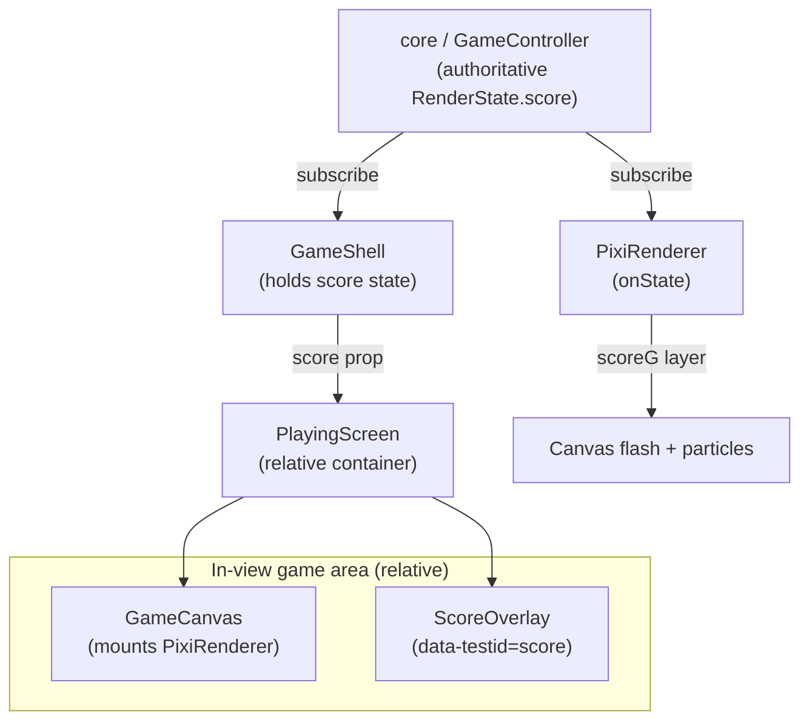

# Design — F4: Dynamic animated score

## Overview

Today the score is a static number ticking in the sidebar HUD. F4 makes scoring
feedback dynamic and impactful **within the game view**: the value animates
(count-up + pop/scale) and an effect plays (gold flash + particles), with bigger
clears producing bigger bursts. Crucially, the authoritative numeric score must
remain assertable via the `data-testid="score"` element — the animation must
never break value assertions.

The design adds presentation only. The score value is owned by the
core/controller exactly as today (`RenderState.score`); `GameShell` already
subscribes, holds `score` state, and passes it down. F4 introduces two
cooperating layers:

1. A React `ScoreOverlay` rendered **over** the Pixi canvas. It owns the single
   `data-testid="score"` element, eases a `displayed` value toward the
   authoritative `score`, finishing exactly on the integer target, and replays a
   pop/scale + glow plus floating "+N" popups on each increase.
2. A renderer (canvas) celebration in `PixiRenderer`. When `RenderState.score`
   increases, it seeds a gold flash and a radiating particle burst scaled by the
   delta, drawn on a dedicated `scoreG` layer above existing effects.

The `score` testid moves from the sidebar into the in-view overlay, so there is
still **exactly one** such element while playing.

## Architecture



Key architectural points:

- **Single source of truth.** `RenderState.score` is unchanged. Both the React
  overlay and the Pixi renderer are independent subscribers/consumers of that
  value; neither mutates it.
- **Two presentation channels, one value.** The DOM overlay handles the
  human-readable, assertable number and its count-up/pop/"+N" juice. The canvas
  renderer handles the in-view flash/particle celebration. They are decoupled
  and react to the same score changes.
- **No core/controller/engine changes.** The work is confined to
  `ScoreOverlay.tsx`, `GameShell.tsx` (`PlayingScreen` layout + removing the
  duplicate sidebar testid), `renderer.ts` (celebration), and `globals.css`
  (keyframes).

## Components and Interfaces

### React: `ScoreOverlay` (`src/game/react/ScoreOverlay.tsx`)

```ts
function ScoreOverlay({ score }: { score: number }): JSX.Element
```

- **Props:** `score: number` — the authoritative current score from the
  controller (via `GameShell`).
- **Count-up:** a `requestAnimationFrame` loop eases an internal `displayed`
  value toward `score`. The rendered text is `Math.round(displayed)`. The loop
  always finishes **on** the integer target within a short window (~450ms,
  ease-out cubic); the final commit sets `displayed` to exactly `score`. If
  `score <= displayed` (restart/reset/decrease) it **snaps immediately** with no
  count-down. (Requirements 1.1, 1.2, 3.3)
- **Pop:** an increase bumps `popKey`; the keyed text wrapper re-mounts to
  replay the CSS `animate-score-pop` keyframe (scale + glow). (Requirement 2.1)
- **Floating "+N":** on increase, push `{ id, amount: delta }` into `floats`;
  each renders an `animate-score-float` element that drifts up and fades, and is
  removed via `setTimeout` (~900ms) after the animation. (Requirement 2.2)
- **Placement:** the root is `pointer-events-none absolute top-3 left-1/2`,
  positioned over the canvas (top-centre). (Requirement 2.4)
- **Authoritative testid:** the value is wrapped in
  `<span data-testid="score">{displayed}</span>`. This is the only such element.
  (Requirement 1.3)

### `GameShell` / `PlayingScreen` (`src/game/react/GameShell.tsx`)

- `PlayingScreen` wraps `GameCanvas` and `ScoreOverlay` in a `relative`
  container so the overlay is absolutely positioned over the canvas:

  ```tsx
  <div className="relative">
    <GameCanvas controller={controller} />
    <ScoreOverlay score={score} />
  </div>
  ```

- The duplicate sidebar score block (its `data-testid="score"`) is **removed**,
  leaving exactly one `data-testid="score"` element while playing.
  (Requirement 1.3) The `GameOverScreen` still shows a plain final-score number,
  but it does not use the `score` testid and is not on screen while playing.
- `GameShell` already creates the controller, subscribes
  (`setScore(rs.score)`), and resets `score` to 0 on start/restart — no change
  needed there beyond passing `score` to `PlayingScreen`.

### `GameCanvas` (`src/game/react/GameCanvas.tsx`)

Unchanged. Mounts and tears down the `PixiRenderer`, calling
`renderer.attach(controller)` after async init. The overlay is a sibling, not a
child, so canvas lifecycle is independent of the overlay.

### Renderer: `PixiRenderer` (`src/game/render/renderer.ts`)

The celebration is layered onto the existing immediate-mode renderer:

- **State fields:** `prevScore: number` (init 0), `scoreFlash: number` (0..1),
  `particles: Particle[]`, and a `scoreG: Graphics` layer added to the stage
  **on top of** `fxG`/`sweepG`.
- **`onState(rs)`** calls `seedScoreCelebration(rs.score)` alongside the
  existing collapse/clear-flash seeding.
- **`seedScoreCelebration(score)`:** `delta = score - prevScore`; updates
  `prevScore`.
  - `delta > 0`: set `scoreFlash = Math.min(1, delta / 12)` and spawn
    `Math.max(6, Math.min(60, Math.round(delta * 3)))` particles with outward
    velocity (random angle/speed, slight upward bias), gold or cyan, drawn from
    spread positions. Bigger clears → brighter flash and more sparks.
    (Requirement 2.3)
  - `delta < 0` (restart): clear `particles` and reset `scoreFlash = 0`.
    (Requirement 3.3)
- **`frame(dtMs)`:** decays `scoreFlash` (`-= dtMs / 420`, clamped at 0) and
  integrates/ages particles (position, gravity `vy += 0.12`, drag `vx *= 0.985`,
  `life -= dtMs / 900`), then calls `drawScoreFx()`.
- **`drawScoreFx()`:** clears `scoreG`, draws a full-board gold tint with alpha
  from `scoreFlash`, then each particle as a core circle plus a soft halo.
- Existing clear flashes, sweep bar/trail, and collapse animation are
  **unchanged**. (Requirement 3.2)

```ts
interface Particle {
  x: number; y: number;
  vx: number; vy: number;
  life: number;   // 0..1, 1 = fresh
  color: number;
  size: number;
}
```

### CSS (`src/styles/globals.css`)

- `@keyframes score-pop` — scale `1 → 1.35 → 1` with a glow, exposed via
  `.animate-score-pop`.
- `@keyframes score-float` — `translateY` up + fade, exposed via
  `.animate-score-float`.
- A `@media (prefers-reduced-motion: reduce)` block collapses both animation
  durations so motion-sensitive users get the value without the movement.

## Data Models

The feature reuses the existing `RenderState`; no new persisted models are
introduced. The presentation state is local and ephemeral.

| Model | Location | Fields | Purpose |
| --- | --- | --- | --- |
| `RenderState.score` | `engine/controller` (existing) | `score: number` | Authoritative integer score; single source of truth. |
| `ScoreOverlay` state | `ScoreOverlay.tsx` | `displayed: number`, `popKey: number`, `floats: FloatItem[]` | Rolling display value, pop remount key, active "+N" popups. |
| `FloatItem` | `ScoreOverlay.tsx` | `id: number`, `amount: number` | One floating "+N" indicator (`amount` = increase delta). |
| `Particle` | `renderer.ts` | `x, y, vx, vy, life, color, size` | One celebratory canvas spark. |
| Renderer celebration | `renderer.ts` | `prevScore: number`, `scoreFlash: number`, `particles: Particle[]` | Tracks score deltas and drives the canvas flash/particle burst. |

Invariants worth noting:

- `displayed` converges to and ends exactly equal to `score` (integer) after a
  count-up; it snaps to `score` immediately when `score <= displayed`.
- `scoreFlash` is always within `[0, 1]`.
- Particle count per scoring event is always within `[6, 60]`.

## Correctness Properties

*A property is a characteristic or behavior that should hold true across all
valid executions of a system — essentially, a formal statement about what the
system should do. Properties serve as the bridge between human-readable
specifications and machine-verifiable correctness guarantees.*

The prework classified most acceptance criteria as example/structural or
regression checks. Two criteria yield genuine universal properties (the
settle-convergence behaviour of the count-up, and the delta-scaled celebration
mapping), plus one structural invariant stated for clarity.

### Property 1: Count-up converges to and settles exactly on the authoritative integer

*For any* sequence of authoritative integer scores fed to `ScoreOverlay`, after
each count-up completes the rendered `data-testid="score"` text SHALL equal
`String(score)`; and *for any* update where the new `score` is less than or
equal to the currently displayed value (including reset to 0), the displayed
value SHALL snap immediately to the new `score` with no count-down.

**Validates: Requirements 1.1, 1.2, 3.3**

### Property 2: Canvas celebration scales with the increase and stays within bounds

*For any* positive score delta, the seeded `scoreFlash` SHALL lie within
`[0, 1]` and the spawned particle count SHALL lie within `[6, 60]`; and both
SHALL be non-decreasing in the size of the delta up to their clamp limits, so a
larger increase never produces a smaller celebration.

**Validates: Requirements 2.3**

### Property 3: Exactly one score testid while playing

*For any* render of `PlayingScreen`, there SHALL be exactly one element matching
`data-testid="score"` in the document.

**Validates: Requirements 1.3**

## Error Handling

- **Out-of-order / rapid score updates:** the count-up effect cancels any
  in-flight `requestAnimationFrame` before starting a new one and re-reads the
  current `displayed` value as its `from`, so overlapping increases never
  produce a stuck or drifting value — the latest target always wins and settles
  exactly.
- **Decrease / reset:** any `score <= displayed` (notably restart to 0) snaps
  immediately and cancels the RAF loop, guaranteeing the testid reads the new
  value without an animated count-down. The renderer mirrors this by clearing
  particles and `scoreFlash` when `delta < 0`.
- **Unmount cleanup:** the overlay cancels its pending RAF in the effect cleanup;
  float popups are removed via `setTimeout` and the list is keyed by id so a
  late timer cannot remove the wrong item. The `PixiRenderer` already guards
  async init against StrictMode double-invoke and destroys cleanly.
- **Reduced motion:** `prefers-reduced-motion` shortens the CSS animations to a
  negligible duration; the numeric value remains correct and assertable.
- **No exceptions across the boundary:** the overlay and renderer only read
  `score`; they never throw into or mutate controller/core state, so a
  presentation glitch cannot corrupt game state.

## Testing Strategy

This feature mixes pure logic (count-up convergence, delta→celebration mapping)
with UI/canvas rendering. Property-based testing applies to the pure logic;
example, structural, and integration tests cover the rest.

### Property-based tests

Use the project's existing test runner (Vitest) with a property-based testing
library for TypeScript (e.g. `fast-check`). Do **not** hand-roll property
testing. Each property test:

- runs a **minimum of 100 iterations**;
- is tagged with a comment referencing its design property in the format
  **Feature: f4-animated-score, Property {number}: {property_text}**.

Properties to implement:

- **Property 1 (settle-convergence):** generate arbitrary non-negative integer
  score sequences / `(from, to)` pairs. For increases, advance fake timers / RAF
  to completion and assert the settled text equals `String(to)`; for
  `to <= from`, assert the displayed value snaps to `to` on the first commit.
- **Property 2 (celebration scaling):** generate arbitrary positive deltas, run
  the `seedScoreCelebration` mapping, and assert `scoreFlash ∈ [0, 1]`, particle
  count `∈ [6, 60]`, and non-decreasing behaviour in delta up to the clamps.

### Example / unit tests

- An increase bumps `popKey` and applies `animate-score-pop` (Req 2.1).
- An increase of N renders a "+N" float that is removed after its timeout
  (Req 2.2).
- The renderer clears particles and resets `scoreFlash` when `delta < 0`
  (Req 3.3).
- `ScoreOverlay` renders inside the `relative` canvas container (Req 2.4).

### Structural / integration tests

- **Property 3 (single testid):** render `PlayingScreen` and assert exactly one
  `data-testid="score"` node; also covered by the E2E suite.
- **Regression (Req 3.1, 3.2):** the existing `core.test.ts` and
  `renderer.test.ts` unit suites and the Playwright E2E score assertions
  (`"0"`, `"4"`, `"12"`) stay green. `pnpm test` (unit) passes and `pnpm build`
  (TEST_MODE) succeeds. Playwright `toHaveText` retries while the brief count-up
  converges, then matches the exact settled integer; restart sees `"0"`.

Run unit/property tests with a single execution (e.g. `pnpm test` / `vitest
--run`) rather than watch mode.
