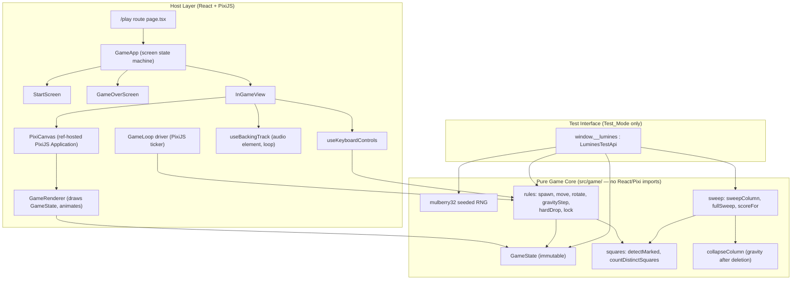
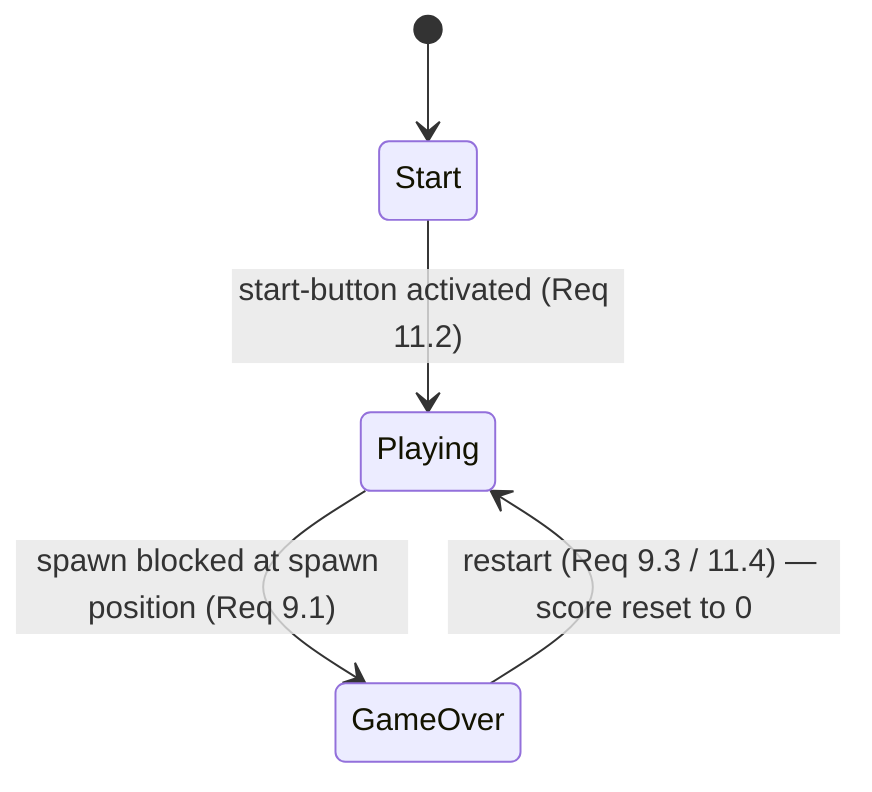

# Design Document

## Overview

LLMines is a browser-based *Lumines* clone built on the existing create-t3-app scaffold
(Next.js App Router, TypeScript, tRPC, Tailwind) with PixiJS for rendering. The design centres
on a strict separation between a **pure, deterministic game-logic core** and a **rendering/host
layer**. The core holds all rules (grid model, piece spawning, gravity, square detection and
marking, the sweep, scoring, and post-deletion gravity) as pure functions over immutable state.
The host layer (React + PixiJS) owns the canvas, the animation/game loop, keyboard input, audio,
and the screen flow (start → in-game → game-over).

This separation delivers two goals from the requirements:

1. **Deterministic testability** — the core is driven by a seeded RNG and advanced by explicit
   step functions, so it can be unit-tested with vitest and exercised end-to-end through a
   `window.__lumines` test interface (Requirements 16–20) without depending on wall-clock time
   or audio.
2. **Polished rendering** — PixiJS renders the immutable core state each frame and interpolates
   animations (falling, sweep, marking, clearing, collapsing) on top of discrete logical state
   transitions (Requirement 14).

### Key Design Decisions

- **Pure functional core, no rendering imports.** The `src/game/` module imports nothing from
  React or PixiJS. Every rule is a pure function `(state, input) => newState`. This makes the
  rules unit-testable and the test API a thin wrapper over the same functions the renderer uses.
  Rationale: guarantees the test harness exercises real game logic, not a parallel reimplementation.
- **Single source of truth: `GameState`.** Both the renderer and the test API read from one
  immutable `GameState` object. The test API's `state()` projection is computed from it.
  Rationale: satisfies Requirement 17.2 (grid reflects both Stack and Active_Block) with no drift.
- **Time abstracted behind a driver.** In normal mode a PixiJS ticker accumulates real time and
  calls core step functions; in Test_Mode the same step functions are called directly by the test
  API. Rationale: Requirement 16.3 / 19 — identical logic, deterministic advancement.
- **Seeded RNG (mulberry32).** A tiny, well-understood 32-bit PRNG gives reproducible piece
  colours from an integer seed (Requirements 2.2, 18.1).
- **Test hooks gated at build/render time.** `window.__lumines` and `data-testid` attributes are
  emitted only when `env.NEXT_PUBLIC_TEST_MODE === "1"`, and are entirely absent otherwise
  (Requirement 16.1).

## Architecture



### Module layout

```
src/
  game/
    types.ts          # Color, Cell, Grid, Piece, GameState, enums
    rng.ts            # mulberry32 seeded RNG
    grid.ts           # grid construction, cloning, bounds, occupancy helpers
    piece.ts          # piece creation, random piece from RNG, rotation
    rules.ts          # spawn, canMove, move, rotate, gravityStep, hardDrop, lock
    squares.ts        # detectMarked, countDistinctSquares
    sweep.ts          # sweepColumn, fullSweep, collapseColumn, scoreFor
    engine.ts         # GameEngine: owns GameState, orchestrates step/sweep/advance, RNG
    constants.ts      # COLS=16, ROWS=10, SPAWN cols/rows, BPM, timings
  app/
    play/
      page.tsx        # mounts GameApp ("use client")
    _game/
      GameApp.tsx        # screen state machine (start|playing|gameover)
      StartScreen.tsx
      InGameView.tsx
      GameOverScreen.tsx
      PixiCanvas.tsx     # creates PixiJS Application into a ref'd div
      GameRenderer.ts    # pure-ish drawing of GameState + animation state
      useGameLoop.ts     # ticker driver (gravity cadence + sweep cadence)
      useKeyboardControls.ts
      useBackingTrack.ts
      ControlsCheatsheet.tsx
      testApi.ts         # installs window.__lumines in Test_Mode
```

### Coordinate and ordering conventions

- The grid is addressed `[row][col]`, row 0 at the top, col 0 at the left (matches Glossary and
  Requirement 17.2). `COLS = 16`, `ROWS = 10`.
- "Down" means increasing row index. The floor is below row 9.
- Spawn position: columns 7–8, rows 0–1 (Requirement 2.1 / 18.2).

## Components and Interfaces

### Pure core

The engine wraps the pure functions and the seeded RNG behind a small imperative-friendly API that
both the host loop and the test API call. The engine never touches the DOM, React, or PixiJS.

```typescript
// src/game/constants.ts
export const COLS = 16;
export const ROWS = 10;
export const SPAWN_COLS = [7, 8] as const;   // left, right
export const SPAWN_ROWS = [0, 1] as const;   // top, bottom
export const BPM = 120;
export const BEAT_MS = 60000 / BPM;          // 500 ms
export const SWEEP_MS_PER_COL = 250;         // 0.25 s/col (Req 6.1)
export const SWEEP_PERIOD_MS = SWEEP_MS_PER_COL * COLS; // 4000 ms
export const GRAVITY_INTERVAL_MS = BEAT_MS;  // one gravity tick per beat (normal play cadence)
```

```typescript
// src/game/engine.ts
export interface GameEngine {
  getState(): GameState;          // immutable snapshot
  seed(n: number): void;          // Req 18.1
  startNewGame(): void;           // Req 7.2, 9.3, 11.2
  spawnRandom(): SpawnResult;     // Req 2 — uses RNG; may trigger game over (Req 9.1)
  spawnPiece(p: Piece): SpawnResult; // Req 18.2/18.3 — lock active first if mid-fall
  moveLeft(): void;               // Req 4.1
  moveRight(): void;              // Req 4.2
  setSoftDrop(on: boolean): void; // Req 4.3
  rotate(): void;                 // Req 4.4
  hardDrop(): void;               // Req 4.5 — move to lowest legal, lock
  gravityStep(): GravityResult;   // Req 3 — one tick; locks if blocked
  fullSweep(): SweepResult;       // Req 6.3/6.4, 7, 8 — one full traversal
  sweepProgress(dtMs: number): SweepResult; // Req 19.4 — advance bar by time; deletes columns crossed
}

export type SpawnResult = { gameOver: boolean };
export type GravityResult = { locked: boolean };
export type SweepResult = { deletedCells: number; distinctSquares: number; scoreDelta: number };
```

Selected pure-function signatures the engine composes:

```typescript
// src/game/rules.ts
export function emptyGrid(): Grid;
export function canPlace(grid: Grid, block: ActiveBlock): boolean;        // bounds + no overlap
export function gravityStep(state: GameState): GameState;                 // move down or lock (Req 3.1/3.2)
export function lock(state: GameState): GameState;                        // write block colours into stack (Req 3.3)
export function move(state: GameState, dCol: number): GameState;          // Req 4.1/4.2/4.7
export function rotate(state: GameState): GameState;                      // Req 4.4/4.7
export function hardDrop(state: GameState): GameState;                    // Req 4.5
export function lowestLegalRow(grid: Grid, block: ActiveBlock): number;

// src/game/squares.ts
export function detectMarked(grid: Grid): boolean[][];                    // Req 5.1/5.2
export function countDistinctSquares(grid: Grid): number;                 // Req 5.3
export function distinctSquaresInColumns(grid: Grid, cols: number[]): number;

// src/game/sweep.ts
export function collapseColumn(grid: Grid, col: number): Grid;            // Req 8.1
export function fullSweep(state: GameState): { state: GameState } & SweepResult; // Req 6/7/8
export function scoreFor(deletedCells: number, distinctSquares: number): number; // Req 7.1: product
```

### Host layer

- **GameApp** — a screen state machine holding `screen: "start" | "playing" | "gameover"` and a
  reference to a single `GameEngine`. Routes between `StartScreen`, `InGameView`, and
  `GameOverScreen` (Requirement 11). Renders exactly one `<main>` landmark (Requirement 13.2).
- **PixiCanvas** — creates a PixiJS `Application` into a `div` via `ref` on mount, destroys it on
  unmount, and hands the `Application` to `GameRenderer` (Requirement 1.1).
- **GameRenderer** — draws the current `GameState` each frame: playfield grid, settled stack cells
  (Color A vs Color B with distinct fills, Requirement 1.3), the active block, marked-cell
  highlight, and the timeline bar. Owns lightweight animation state for falling, sweeping,
  marking, clearing, and collapsing (Requirement 14).
- **useGameLoop** — in normal mode, subscribes to the PixiJS ticker, accumulates elapsed time, and
  calls `engine.gravityStep()` on the gravity cadence and `engine.sweepProgress(dt)` continuously
  for the sweep. Disabled in Test_Mode (Requirement 16.3).
- **useKeyboardControls** — maps `h/j/k/l/space` and arrow aliases to engine calls
  (Requirement 4.1–4.7).
- **useBackingTrack** — manages an `<audio>` element with `src="/backing-track.mp3"` and `loop`
  enabled, starting playback when a session begins (Requirement 10).
- **ControlsCheatsheet** — shown on the start screen and persistently in-game (Requirement 12),
  carrying `data-testid="controls-cheatsheet"` (Requirement 20.5).
- **testApi** — when `NEXT_PUBLIC_TEST_MODE === "1"`, installs `window.__lumines` bound to the live
  engine (Requirements 16–19).

```typescript
// LuminesTestApi — exact interface exposed at window.__lumines in Test_Mode
export interface LuminesTestApi {
  state(): { grid: (Color | null)[][]; score: number; gameOver: boolean; sweepX: number }; // Req 17.1/17.2
  marked(): { row: number; col: number }[];                 // Req 17.3
  seed(n: number): void;                                     // Req 18.1
  spawn(piece: Piece): void;                                 // Req 18.2/18.3/18.4
  tick(): void;                                              // Req 19.1/19.2
  sweepNow(): void;                                          // Req 19.3
  sweepProgress(dtMs: number): void;                         // Req 19.4
}
declare global {
  interface Window { __lumines?: LuminesTestApi }
}
```

### Screen flow



## Data Models

```typescript
// src/game/types.ts

// Color: exactly two values (Glossary, Requirement 1.3)
export type Color = 0 | 1;            // 0 = Color A, 1 = Color B

// Cell: empty or a colour
export type Cell = Color | null;

// Grid: [row][col], row 0 at top; 10 rows × 16 cols (Req 17.2)
export type Grid = Cell[][];

// Piece: 2×2, [topRow, bottomRow], each [leftCol, rightCol] (Glossary)
export type Piece = [[Color, Color], [Color, Color]];

// ActiveBlock: a Piece plus its top-left position on the grid
export interface ActiveBlock {
  piece: Piece;
  row: number;   // row of the block's top cells
  col: number;   // col of the block's left cells
}

// GameState: the single immutable source of truth
export interface GameState {
  grid: Grid;                 // settled Stack only (Active_Block kept separate)
  active: ActiveBlock | null; // current falling block, or null when quiescent
  marked: boolean[][];        // marked designation per stack cell (Req 5)
  score: number;              // Req 7
  gameOver: boolean;          // Req 9
  sweepX: number;             // sweep bar position in [0, COLS] (Req 17.1)
  softDrop: boolean;          // soft-drop active (Req 4.3)
  rngState: number;           // current seeded RNG state (Req 18.1)
}
```

Notes:

- `grid` stores only the settled Stack. The **composite** grid returned by the test API's
  `state()` overlays `active` onto a copy of `grid` (Requirement 17.2). This keeps lock/gravity
  logic simple and avoids ambiguity between "falling" and "settled" cells.
- `marked` is recomputed from `grid` whenever the Stack changes (Requirements 5.1/5.2, 8.2). It is
  derived data cached on the state for cheap rendering and `marked()` queries.
- `sweepX` is a continuous value in `[0, 16]`; the integer columns it has crossed since the last
  frame determine which columns get deleted (Requirement 19.4). Rendering interpolates the bar at
  `sweepX`.

### Distinct_Square counting model

A `Monochrome_2x2` exists at top-left `(r, c)` when all four of `grid[r][c]`, `grid[r][c+1]`,
`grid[r+1][c]`, `grid[r+1][c+1]` are non-null and equal. `countDistinctSquares` iterates every
valid top-left `(r, c)` with `0 ≤ r ≤ ROWS-2`, `0 ≤ c ≤ COLS-2` and counts one per qualifying
top-left (Requirement 5.3). `detectMarked` marks all four member cells of every such square
(Requirement 5.1) and leaves all others unmarked (Requirement 5.2).

### Sweep, deletion, scoring, and post-deletion gravity

When the bar crosses column `c`:

1. Recompute `marked` from the current `grid`.
2. Delete every `Marked_Cell` in column `c` (set to `null`), counting deleted cells
   (Requirement 6.3).
3. Compute Distinct_Squares cleared by that crossing (squares whose cells were among those deleted),
   used together with deleted-cell count for scoring.
4. `score += scoreFor(deletedCells, distinctSquares)` = `deletedCells * distinctSquares`
   (Requirement 7.1). Zero when nothing is deleted (no score change).
5. Collapse column `c` so no empty cell remains below an occupied cell (Requirement 8.1).
6. Recompute `marked` (Requirement 8.2).

`fullSweep` performs steps 1–6 for columns 0..15 in order. A `Sweep_Deletion_Event` aggregates the
deletions across a full traversal for scoring per Requirement 7.1; the design scores per traversal
using the total cells deleted and total distinct squares cleared during that traversal, matching
the "during that Sweep_Deletion_Event" wording.

## Correctness Properties

*A property is a characteristic or behavior that should hold true across all valid executions of a
system — essentially, a formal statement about what the system should do. Properties serve as the
bridge between human-readable specifications and machine-verifiable correctness guarantees.*

The game core is a set of pure functions over immutable state with a large, structured input space
(grids, pieces, positions, seeds), which makes it an excellent fit for property-based testing.
The following properties were derived from the prework analysis of the acceptance criteria.

### Property 1: Spawn placement and colouring

*For any* RNG seed and any empty-enough spawn region, spawning places the four block cells exactly
at columns 7–8, rows 0–1, and each composite cell there holds Color A or Color B.

**Validates: Requirements 2.1, 2.2, 18.2**

### Property 2: Gravity moves down or locks, never overlaps

*For any* reachable `GameState` with an active block, one `gravityStep` either moves the block down
exactly one row (when the cells below are in-bounds and unoccupied) or locks it into the Stack; in
no case does the active block ever overlap a Stack cell or leave the Playfield.

**Validates: Requirements 3.1, 3.2**

### Property 3: Lock preserves block colours into the stack

*For any* active block that locks, every occupied stack cell at the block's footprint equals the
colour of the corresponding block cell, and no other stack cell changes.

**Validates: Requirements 3.3**

### Property 4: Horizontal move legality and reversibility

*For any* `GameState` and a horizontal move, if the destination is within the Playfield and free of
Stack cells the block shifts by exactly one column; otherwise the block's position and orientation
are unchanged. Moving left then right (when both are legal) returns the block to its original
column.

**Validates: Requirements 4.1, 4.2, 4.7**

### Property 5: Rotation legality and bounds safety

*For any* `GameState`, rotation either yields an orientation that fits within the Playfield without
overlapping Stack cells, or leaves the block unchanged; the resulting block is always within bounds
and overlap-free.

**Validates: Requirements 4.4, 4.7**

### Property 6: Hard drop lands at the lowest legal row and locks

*For any* `GameState` with an active block, after a hard drop the block occupies the lowest legal
row (it could not move further down) and is locked into the Stack.

**Validates: Requirements 4.5**

### Property 7: Marking exactly covers monochrome 2×2 membership

*For any* grid, a cell is marked if and only if it is a member of at least one Monochrome_2x2.

**Validates: Requirements 5.1, 5.2**

### Property 8: Distinct square count equals qualifying top-left corners

*For any* grid, `countDistinctSquares` equals the number of top-left corners `(r, c)` whose four
aligned cells share a single colour.

**Validates: Requirements 5.3**

### Property 9: Sweep period and per-column rate

*For any* elapsed time `dt`, `sweepProgress` advances `sweepX` by `dt / 250` columns, so a full
16-column traversal corresponds to 4000 ms (0.25 s per column).

**Validates: Requirements 6.1, 19.4**

### Property 10: Sweep deletes exactly the marked cells it crosses

*For any* grid with a known marked set, a full sweep deletes every Marked_Cell and leaves every
unmarked cell present (subject only to post-deletion collapse).

**Validates: Requirements 6.3**

### Property 11: Scoring equals cells deleted times distinct squares cleared

*For any* Sweep_Deletion_Event, the score increase equals the number of cells deleted multiplied by
the number of Distinct_Squares cleared during that event, and is zero when no cells are deleted.

**Validates: Requirements 7.1**

### Property 12: Post-deletion gravity leaves no floating gaps

*For any* column after deletion, collapsing it leaves no empty cell below an occupied cell, and the
multiset of remaining colours in that column is unchanged by the collapse.

**Validates: Requirements 8.1**

### Property 13: Marking is re-evaluated after collapse

*For any* grid, the marked set after a sweep equals `detectMarked` applied to the post-collapse
grid (marking is consistent with the final settled stack).

**Validates: Requirements 5.1, 5.2, 8.2**

### Property 14: Game over exactly when spawn region is blocked

*For any* `GameState`, spawning sets `gameOver` to true if and only if at least one of the spawn
cells (columns 7–8, rows 0–1) is occupied by a Stack cell.

**Validates: Requirements 9.1**

### Property 15: Composite state grid reflects stack plus active block

*For any* `GameState`, the grid returned by `state()` equals the settled stack with the active
block overlaid, sized 16 columns × 10 rows, ordered `[row][col]` with row 0 at top.

**Validates: Requirements 17.1, 17.2**

### Property 16: Seeded generation is deterministic

*For any* seed `n`, seeding with `n` and generating a sequence of random pieces produces the same
sequence every time.

**Validates: Requirements 2.2, 18.1**

### Property 17: Spawn while mid-fall locks the existing block first

*For any* `GameState` with an active block mid-fall, calling `spawn(piece)` first locks the existing
block into the Stack and then places the given piece at the spawn position; consecutive `spawn`
calls stack deterministically.

**Validates: Requirements 18.3, 18.4**

### Property 18: Tick locks leave the field quiescent in Test_Mode

*For any* `GameState` where a `tick()` causes the active block to lock, no new block is spawned and
`active` becomes null until `spawn()` is called.

**Validates: Requirements 19.2**

## Error Handling

- **Invalid test input.** `seed(n)` coerces non-integer/NaN inputs to a 32-bit unsigned integer
  (`n >>> 0`), defaulting to `0`. `spawn(piece)` validates the piece shape (2×2 of `0|1`); an
  invalid piece is rejected without mutating state and logged to the console in Test_Mode only.
- **Out-of-bounds moves/rotations.** All movement and rotation go through `canPlace`; illegal
  inputs are no-ops that preserve position and orientation (Requirement 4.7), so input handling
  never throws.
- **Game over interactions.** While `gameOver` is true, gravity, movement, rotation, and sweep
  calls are no-ops; only `startNewGame` (restart) transitions out (Requirements 9.1, 9.3).
- **PixiJS lifecycle.** `PixiCanvas` guards against double-initialisation in React strict mode and
  destroys the `Application` on unmount to avoid leaked WebGL contexts. If WebGL is unavailable,
  PixiJS falls back to canvas; the game logic is unaffected because it is decoupled from rendering.
- **Audio autoplay restrictions.** Browsers may block audio until a user gesture. Playback is
  started from the start-button click handler (a user gesture), and a failed `play()` promise is
  caught and ignored so gameplay continues without music (Requirement 10.3 is satisfied on the
  gesture path).
- **Test hook isolation.** When `NEXT_PUBLIC_TEST_MODE !== "1"`, `window.__lumines` is never
  assigned and no `data-testid` attributes are rendered (Requirement 16.1).

## Testing Strategy

Property-based testing **is** appropriate here: the game core is composed of pure functions with
clear input/output behaviour over a large structured input space (grids, pieces, positions, seeds).
The host/rendering layer (PixiJS canvas, audio, screen transitions) is **not** suited to PBT and is
covered by example-based unit tests and Playwright end-to-end tests instead.

### Tooling

- **vitest** for unit and property tests of the pure core (`src/game/`). PBT uses **fast-check**
  (the standard property-testing library for the TS/JS ecosystem); it will be added as a dev
  dependency rather than hand-rolled.
- **Playwright** for end-to-end tests that run the app with `NEXT_PUBLIC_TEST_MODE=1` and drive it
  through `window.__lumines` and the `data-testid` hooks.

### Property tests (core)

- Each Correctness Property (1–18) is implemented as a **single** fast-check property test.
- Each property test runs a **minimum of 100 iterations**.
- Custom arbitraries generate: random `Color`, random `Piece`, random `Grid` (including sparse,
  full, and monochrome-cluster-biased grids to exercise marking/squares), random seeds, and random
  reachable `GameState`s. Generators explicitly cover edge cases: empty grid, full column,
  non-ASCII not applicable, single-colour fields, and spawn-region occupancy.
- Each property test is tagged with a comment of the form
  `// Feature: llmines, Property N: <property text>`.

### Unit tests (examples and edge cases)

- Concrete examples: a known seed produces a known piece sequence; a hand-built grid produces a
  known marked set and Distinct_Square count; a specific stacked scenario scores a known value.
- Edge cases: spawn into an occupied region triggers game over; hard drop onto the floor; rotation
  against the right wall is a no-op; collapse of a column with interleaved gaps.

### Integration / end-to-end tests (Playwright, Test_Mode)

These verify wiring that PBT cannot, using 1–3 representative scenarios each:

- Start flow: load page → `data-testid="start-button"` visible with controls cheatsheet →
  click → `InGameView` shows `data-testid="score"` = `0` and `data-testid="controls-cheatsheet"`.
- Deterministic play: `seed` → `spawn` → `tick`/`sweepNow` → assert `state()` and `marked()`.
- Scoring: build a monochrome region via `spawn`, `sweepNow`, assert `state().score`.
- Game over: stack to the spawn region → `spawn` → `data-testid="game-over"` and final score shown →
  `data-testid="restart"` returns to play with score `0`.
- Isolation: with the flag unset, `window.__lumines` is `undefined` and `data-testid` hooks are
  absent.
- Structure: exactly one `<main>` element (Requirement 13.2); music credit text present
  (Requirement 15).

### Test_Mode determinism

In Test_Mode the game loop (ticker-driven gravity and sweep) is disabled; state advances only via
`tick()`, `spawn()`, `sweepNow()`, and `sweepProgress()` (Requirement 16.3, 19). This makes both the
property tests and Playwright tests fully deterministic and independent of wall-clock time and
audio.
