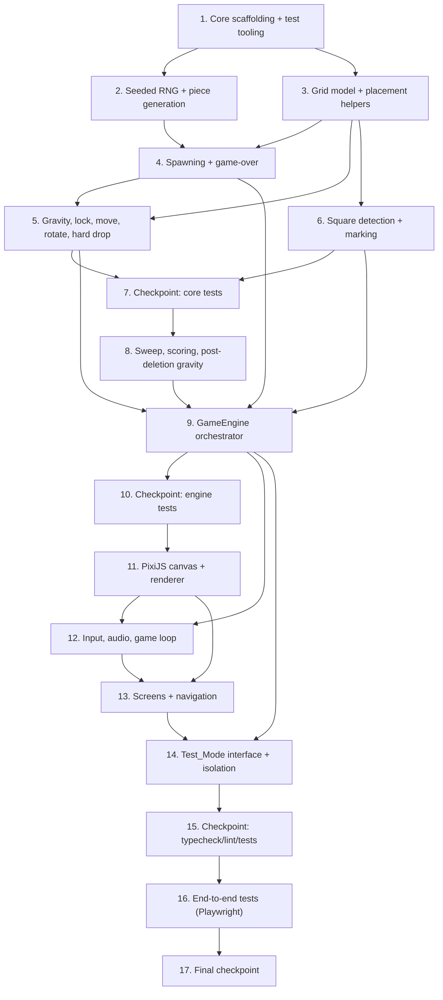

# Implementation Plan: LLMines


## Overview

This plan implements LLMines incrementally, building the pure game-logic core first (fully
unit- and property-tested with vitest + fast-check), then wiring it into the PixiJS renderer,
React screen flow, input, and audio, and finally exposing the Test_Mode interface and DOM hooks
for Playwright. Each task builds on the previous ones and ends with integration so there is no
orphaned code. Implementation language is **TypeScript** throughout.

Test sub-tasks marked with `*` are optional and may be skipped for a faster MVP. Property tests use
fast-check, run a minimum of 100 iterations each, and are tagged
`// Feature: llmines, Property N: <text>`.

## Tasks

- [x] 1. Set up game-core scaffolding and test tooling
  - Create `src/game/` with `constants.ts` (COLS=16, ROWS=10, SPAWN_COLS=[7,8], SPAWN_ROWS=[0,1], BPM=120, BEAT_MS, SWEEP_MS_PER_COL=250, SWEEP_PERIOD_MS=4000, GRAVITY_INTERVAL_MS) and `types.ts` (`Color`, `Cell`, `Grid`, `Piece`, `ActiveBlock`, `GameState`)
  - Add and configure vitest and fast-check as dev dependencies; add a `test` script to `package.json`; create a minimal `vitest.config.ts`
  - _Requirements: 1.1, 6.1_

- [x] 2. Implement seeded RNG and piece generation
  - [x] 2.1 Implement `mulberry32` seeded RNG in `src/game/rng.ts` with `seed(n)` (coerce via `n >>> 0`) and `nextFloat()`/`nextColor()`
    - _Requirements: 2.2, 18.1_
  - [x] 2.2 Implement `randomPiece(rng)` and `rotatePiece(piece)` in `src/game/piece.ts`, producing a `Piece` of four independently-coloured cells
    - _Requirements: 2.2, 4.4_
  - [x]* 2.3 Write property test for seeded determinism
    - **Property 16: Seeded generation is deterministic**
    - **Validates: Requirements 2.2, 18.1**

- [x] 3. Implement grid model and placement helpers
  - Create `src/game/grid.ts`: `emptyGrid()`, `cloneGrid()`, `inBounds(r,c)`, `isOccupied(grid,r,c)`, and `blockCells(block)` (footprint coordinates + colours)
  - Create `src/game/rules.ts` `canPlace(grid, block)` (within bounds and no overlap with stack)
  - _Requirements: 1.2, 3.1, 4.7_

- [x] 4. Implement spawning and game-over detection
  - [x] 4.1 Implement `spawnPiece(state, piece)` and `spawnRandom(state)` in `rules.ts`: place at columns 7-8, rows 0-1; set `gameOver` when any spawn cell is occupied
    - _Requirements: 2.1, 2.2, 9.1, 18.2_
  - [x]* 4.2 Write property test for spawn placement and colouring
    - **Property 1: Spawn placement and colouring**
    - **Validates: Requirements 2.1, 2.2, 18.2**
  - [x]* 4.3 Write property test for game-over condition
    - **Property 14: Game over exactly when spawn region is blocked**
    - **Validates: Requirements 9.1**

- [x] 5. Implement gravity, locking, movement, rotation, and hard drop
  - [x] 5.1 Implement `gravityStep(state)` and `lock(state)` in `rules.ts` (move down one row if free, else lock; lock writes block colours into the stack)
    - _Requirements: 3.1, 3.2, 3.3_
  - [x]* 5.2 Write property test for gravity step / lock invariant
    - **Property 2: Gravity moves down or locks, never overlaps**
    - **Validates: Requirements 3.1, 3.2**
  - [x]* 5.3 Write property test for lock colour preservation
    - **Property 3: Lock preserves block colours into the stack**
    - **Validates: Requirements 3.3**
  - [x] 5.4 Implement `move(state, dCol)` and `rotate(state)` with legality checks (no-op when illegal)
    - _Requirements: 4.1, 4.2, 4.4, 4.7_
  - [x]* 5.5 Write property test for horizontal move legality and reversibility
    - **Property 4: Horizontal move legality and reversibility**
    - **Validates: Requirements 4.1, 4.2, 4.7**
  - [x]* 5.6 Write property test for rotation legality and bounds safety
    - **Property 5: Rotation legality and bounds safety**
    - **Validates: Requirements 4.4, 4.7**
  - [x] 5.7 Implement `lowestLegalRow(grid, block)` and `hardDrop(state)` (drop to lowest legal row then lock)
    - _Requirements: 4.5_
  - [x]* 5.8 Write property test for hard drop
    - **Property 6: Hard drop lands at the lowest legal row and locks**
    - **Validates: Requirements 4.5**

- [x] 6. Implement square detection, marking, and distinct-square counting
  - [x] 6.1 Implement `detectMarked(grid)` and `countDistinctSquares(grid)` in `src/game/squares.ts`
    - _Requirements: 5.1, 5.2, 5.3_
  - [x]* 6.2 Write property test for marking membership
    - **Property 7: Marking exactly covers monochrome 2x2 membership**
    - **Validates: Requirements 5.1, 5.2**
  - [x]* 6.3 Write property test for distinct-square counting
    - **Property 8: Distinct square count equals qualifying top-left corners**
    - **Validates: Requirements 5.3**

- [x] 7. Checkpoint - Ensure all core tests pass
  - Ensure all tests pass, ask the user if questions arise.

- [x] 8. Implement sweep, scoring, and post-deletion gravity
  - [x] 8.1 Implement `scoreFor(deletedCells, distinctSquares)` (product) and `collapseColumn(grid, col)` in `src/game/sweep.ts`
    - _Requirements: 7.1, 8.1_
  - [x]* 8.2 Write property test for post-deletion gravity
    - **Property 12: Post-deletion gravity leaves no floating gaps**
    - **Validates: Requirements 8.1**
  - [x] 8.3 Implement `fullSweep(state)` (delete marked cells column-by-column, score the event, collapse, re-mark) and `sweepProgress(state, dtMs)` advancing `sweepX` at 0.25s/col and deleting crossed columns
    - _Requirements: 6.1, 6.2, 6.3, 6.4, 7.1, 8.1, 8.2, 19.4_
  - [x]* 8.4 Write property test for sweep deletion
    - **Property 10: Sweep deletes exactly the marked cells it crosses**
    - **Validates: Requirements 6.3**
  - [x]* 8.5 Write property test for scoring
    - **Property 11: Scoring equals cells deleted times distinct squares cleared**
    - **Validates: Requirements 7.1**
  - [x]* 8.6 Write property test for sweep timing
    - **Property 9: Sweep period and per-column rate**
    - **Validates: Requirements 6.1, 19.4**
  - [x]* 8.7 Write property test for re-marking after collapse
    - **Property 13: Marking is re-evaluated after collapse**
    - **Validates: Requirements 5.1, 5.2, 8.2**

- [x] 9. Implement the GameEngine orchestrator
  - [x] 9.1 Create `src/game/engine.ts` wrapping `GameState` + RNG: `getState`, `seed`, `startNewGame` (score 0), `spawnRandom`, `spawnPiece` (lock active first if mid-fall), `moveLeft/Right`, `setSoftDrop`, `rotate`, `hardDrop`, `gravityStep`, `fullSweep`, `sweepProgress`, and a `compositeGrid()` projection overlaying the active block
    - _Requirements: 2.3, 7.2, 9.3, 17.1, 17.2, 18.3, 18.4, 19.2_
  - [x]* 9.2 Write property test for composite grid projection
    - **Property 15: Composite state grid reflects stack plus active block**
    - **Validates: Requirements 17.1, 17.2**
  - [x]* 9.3 Write property test for spawn-while-mid-fall locking
    - **Property 17: Spawn while mid-fall locks the existing block first**
    - **Validates: Requirements 18.3, 18.4**
  - [x]* 9.4 Write property test for quiescence after a locking tick
    - **Property 18: Tick locks leave the field quiescent in Test_Mode**
    - **Validates: Requirements 19.2**
  - [x]* 9.5 Write unit tests for engine examples and edge cases
    - Known seed -> known piece sequence; startNewGame -> score 0; spawn into occupied region -> gameOver; sweepX wraps after column 16
    - _Requirements: 2.3, 6.2, 7.2, 9.1_

- [x] 10. Checkpoint - Ensure all engine tests pass
  - Ensure all tests pass, ask the user if questions arise.

- [x] 11. Build the PixiJS canvas host and renderer
  - [x] 11.1 Create `src/app/_game/PixiCanvas.tsx` ("use client") that creates a PixiJS `Application` into a ref'd `div` on mount and destroys it on unmount (guard React strict-mode double-init)
    - _Requirements: 1.1_
  - [x] 11.2 Create `src/app/_game/GameRenderer.ts` drawing `engine.compositeGrid()` each frame: grid, Color A vs Color B distinct fills, active block, marked-cell highlight, and the timeline bar at `sweepX`
    - _Requirements: 1.1, 1.2, 1.3, 14.1, 14.2, 14.3_

- [x] 12. Implement input, audio, and the normal-play game loop
  - [x] 12.1 Create `src/app/_game/useKeyboardControls.ts` mapping `h/l/j/k/space` and arrow aliases to engine calls
    - _Requirements: 4.1, 4.2, 4.3, 4.4, 4.5, 4.6, 13.1_
  - [x] 12.2 Create `src/app/_game/useBackingTrack.ts` managing an `<audio>` element with `src="/backing-track.mp3"`, `loop` enabled, starting playback on session start (catch blocked autoplay)
    - _Requirements: 10.1, 10.2, 10.3_
  - [x] 12.3 Create `src/app/_game/useGameLoop.ts` driving gravity cadence and continuous `sweepProgress` from the PixiJS ticker during normal play, locked to 120 BPM; disabled in Test_Mode
    - _Requirements: 6.1, 6.2, 10.4, 16.3_

- [x] 13. Build screens and navigation
  - [x] 13.1 Create `ControlsCheatsheet.tsx` (`data-testid="controls-cheatsheet"`) and `StartScreen.tsx` (start control `data-testid="start-button"`, cheatsheet + how-to-play)
    - _Requirements: 11.1, 12.1, 20.1, 20.5_
  - [x] 13.2 Create `InGameView.tsx` hosting PixiCanvas, live score (`data-testid="score"` equal to score value), and persistent cheatsheet
    - _Requirements: 7.3, 11.3, 12.2, 20.3_
  - [x] 13.3 Create `GameOverScreen.tsx` with final score, restart control (`data-testid="restart"`), and `data-testid="game-over"` element
    - _Requirements: 9.2, 9.3, 11.4, 20.2, 20.4_
  - [x] 13.4 Create `GameApp.tsx` screen state machine (start|playing|gameover) wiring engine, loop, input, audio, and screens; render exactly one `<main>`; show music credit in footer; transition to game-over on blocked spawn and reset to score 0 on restart
    - _Requirements: 9.1, 9.3, 11.2, 13.2, 15.1_
  - [x] 13.5 Create `src/app/play/page.tsx` mounting `GameApp`
    - _Requirements: 1.1, 11.1_

- [x] 14. Implement Test_Mode interface and isolation
  - [x] 14.1 Add `NEXT_PUBLIC_TEST_MODE` to `src/env.js` client schema
    - _Requirements: 16.1, 16.2_
  - [x] 14.2 Create `src/app/_game/testApi.ts` installing `window.__lumines` (`state`, `marked`, `seed`, `spawn`, `tick`, `sweepNow`, `sweepProgress`) only when `NEXT_PUBLIC_TEST_MODE === "1"`; gate all `data-testid` attributes and disable the auto loop in Test_Mode
    - _Requirements: 16.1, 16.2, 16.3, 17.1, 17.2, 17.3, 18.1, 18.2, 18.3, 18.4, 19.1, 19.2, 19.3, 19.4_
  - [x]* 14.3 Write unit test asserting the Test_Api shape and that `state()` returns `grid`/`score`/`gameOver`/`sweepX`
    - _Requirements: 17.1, 17.3_

- [x] 15. Checkpoint - Ensure typecheck, lint, and all tests pass
  - Ensure all tests pass, ask the user if questions arise.

- [x] 16. End-to-end tests (Playwright, Test_Mode)
  - [x]* 16.1 Set up Playwright and a config that runs the app with `NEXT_PUBLIC_TEST_MODE=1`
    - _Requirements: 16.2_
  - [x]* 16.2 Write start/flow e2e: start-button + cheatsheet visible -> click -> in-game score `0` and persistent cheatsheet
    - _Requirements: 11.1, 11.2, 11.3, 12.1, 12.2, 20.1, 20.3, 20.5_
  - [x]* 16.3 Write deterministic mechanics e2e via `window.__lumines`: seed -> spawn -> tick/sweepNow -> assert `state()` and `marked()`; build a monochrome region and assert score
    - _Requirements: 7.1, 18.2, 19.1, 19.3_
  - [x]* 16.4 Write game-over e2e: stack to spawn region -> `data-testid="game-over"` and final score -> `restart` returns to play with score `0`
    - _Requirements: 9.1, 9.2, 9.3, 20.2, 20.4_
  - [x]* 16.5 Write isolation + structure e2e: flag unset -> `window.__lumines` undefined and no `data-testid` hooks; exactly one `<main>`; music credit present
    - _Requirements: 13.2, 15.1, 16.1_

- [x] 17. Final checkpoint - Ensure all tests pass
  - Ensure all tests pass, ask the user if questions arise.

## Task Dependency Graph



```json
{
  "waves": [
    { "wave": 1, "tasks": ["1"] },
    { "wave": 2, "tasks": ["2", "3"] },
    { "wave": 3, "tasks": ["4", "6"] },
    { "wave": 4, "tasks": ["5"] },
    { "wave": 5, "tasks": ["7"] },
    { "wave": 6, "tasks": ["8"] },
    { "wave": 7, "tasks": ["9"] },
    { "wave": 8, "tasks": ["10"] },
    { "wave": 9, "tasks": ["11"] },
    { "wave": 10, "tasks": ["12", "13"] },
    { "wave": 11, "tasks": ["14"] },
    { "wave": 12, "tasks": ["15"] },
    { "wave": 13, "tasks": ["16"] },
    { "wave": 14, "tasks": ["17"] }
  ]
}
```

## Notes

- Tasks marked with `*` are optional (tests) and can be skipped for a faster MVP.
- Each task references specific requirement sub-clauses for traceability.
- Property tests (Properties 1-18) live close to the core code they validate to catch errors early,
  use fast-check with >=100 iterations, and carry the `// Feature: llmines, Property N:` tag.
- The pure core (`src/game/`) imports nothing from React or PixiJS, keeping it deterministic and
  unit-testable.
